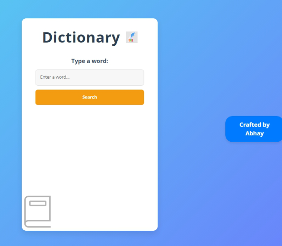

<!DOCTYPE html>
<html lang="en">
  <head>
    <meta charset="UTF-8" />
    <meta http-equiv="X-UA-Compatible" content="IE=edge" />
    <meta name="viewport" content="width=device-width, initial-scale=1.0" />
    

    <!-- bootstrap css cdn link  -->
    <link
      href="https://cdn.jsdelivr.net/npm/bootstrap@5.2.3/dist/css/bootstrap.min.css"
      rel="stylesheet"
      integrity="sha384-rbsA2VBKQhggwzxH7pPCaAqO46MgnOM80zW1RWuH61DGLwZJEdK2Kadq2F9CUG65"
      crossorigin="anonymous"
    />

    <!-- custom css file -->
    <link rel="stylesheet" href="css/style.css" />

    <!-- google font link -->
    <link rel="preconnect" href="https://fonts.googleapis.com" />
    <link rel="preconnect" href="https://fonts.gstatic.com" crossorigin />
    <link
      href="https://fonts.googleapis.com/css2?family=Josefin+Sans:wght@300;400;500;600;700&display=swap"
      rel="stylesheet"
    />

    <!-- bootstrap icon cdn link  -->
    <link
      rel="stylesheet"
      href="https://cdn.jsdelivr.net/npm/bootstrap-icons@1.10.4/font/bootstrap-icons.css"
    />

    <!-- for adding animation to website we have use AOS library 
    AOS Library css file cdn link -->
    <link rel="stylesheet" href="https://unpkg.com/aos@next/dist/aos.css" />

    <!-- jquery cdn link  -->
    
  </head>
  <body>
    <!-- portfolio section starts here -->
    <section class="portfolio" id="portfolio">
      

        <small>Creative Work</small>
        <h3>Check My Portfolio</h3>
      

      

        <!-- here we will create custom attribute using data- for filtering -->
        <button class="filter-item" data-filter="all">All</button>
        <button class="filter-item" data-filter="game">Game</button>
        <button class="filter-item" data-filter="webapp">Web App</button>
        <button class="filter-item" data-filter="website">Website</button>
        <button class="filter-item" data-filter="brand">Brand</button>
      

      

        

          

            

              
              

                <h4 class="card-title">2048 Game</h4>
                HTML&CSS
                JavaScript
                Game 
                <a href="#" class="link">Read More</a>
              

            

          

          

            

              
              

                <h4 class="card-title">Converter App</h4>
                HTML&CSS
                JavaScript
                Website 
                <a href="#" class="read-more-btn link">Read More</a>
              

            

          

          

            

              
              

                <h4 class="card-title">Dictionary</h4>
                HTML&CSS
                JavaScript
                WebApp 
                <a href="#" class="read-more-btn link">Read More</a>
              

            

          

        

        

          

            

              
              

                <h4 class="card-title">PicEditor App</h4>
                HTML&CSS
                JavaScript
                App 
                <a href="#" class="read-more-btn link">Read More</a>
              

            

          

          

            

              
              

                <h4 class="card-title">TicTacToe Game</h4>
                HTML&CSS
                JavaScript
                Game 
                <a href="#" class="read-more-btn link">Read More</a>
              

            

          

          

            

              
              

                <h4 class="card-title">Lang Translator</h4>
                HTML&CSS
                JavaScript
                Web App 
                <a href="#" class="read-more-btn link">Read More</a>
              

            

          

        

      

    </section>
    <!-- portfolio section ends here -->

   
      <!-- bootstrap javascript cdn link  -->
    

    <!-- AOS library javascript link  -->
    
    
    <!-- custom js file linking -->
    
    
  </body>
</html>
